# SloeLux Performance Bot - Architectural Document

## Table of Contents
1. [High-Level Application Overview](#high-level-application-overview)
2. [System Architecture](#system-architecture)
3. [Main Components](#main-components)
4. [Key Data Models](#key-data-models)
5. [Core Workflows](#core-workflows)
6. [Technology Stack](#technology-stack)
7. [External Integrations](#external-integrations)
8. [Deployment Architecture](#deployment-architecture)
9. [Monitoring & Observability](#monitoring--observability)
10. [Security Considerations](#security-considerations)

## High-Level Application Overview

### Purpose
The SloeLux Performance Bot is an **automated web performance monitoring and optimization system** designed specifically for the SloeLux e-commerce website. The system continuously monitors website performance metrics, identifies optimization opportunities, and automatically applies fixes to improve user experience and Core Web Vitals scores.

### Key Objectives
- **Continuous Monitoring**: 24/7 performance tracking of critical pages
- **Automated Optimization**: AI-driven theme and asset optimization
- **SLA Compliance**: Ensure performance metrics meet defined thresholds
- **Proactive Alerting**: Real-time notifications for performance degradation
- **Safe Deployment**: Preview-first optimization with rollback capabilities

### Business Value
- Improved user experience through faster page loads
- Better SEO rankings via Core Web Vitals optimization
- Reduced manual intervention in performance management
- Data-driven insights for performance optimization decisions

## System Architecture

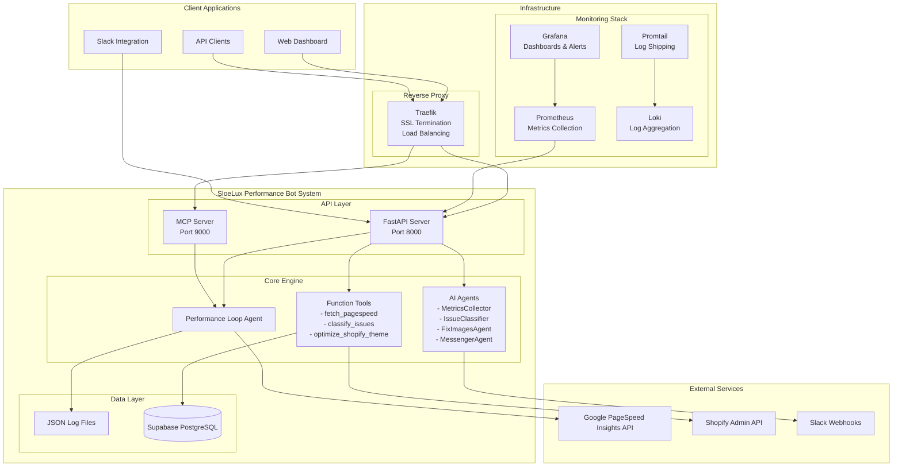

## Main Components

### 1. Frontend Components
**Web Dashboard** (Accessed via Grafana)
- **Purpose**: Real-time performance monitoring and alerting interface
- **Technology**: Grafana dashboards with custom panels
- **Features**:
  - Performance metrics visualization
  - Alert management
  - Historical trend analysis
  - System health monitoring

### 2. Backend Components

#### FastAPI Server (`fastapi_server.py`)
- **Purpose**: Primary REST API for external integrations
- **Port**: 8000
- **Key Endpoints**:
  - `GET /` - Health check
  - `POST /analyze` - Trigger performance analysis
  - `POST /optimize` - Apply theme optimizations
  - `GET /metrics` - Retrieve performance data
  - `GET /status` - Bot status information
  - `POST /webhook/deploy` - Deployment webhooks

#### MCP Server (`mcp_server.py`)
- **Purpose**: Model Context Protocol server for AI agent communication
- **Port**: 9000
- **Features**: Function registration and execution for AI agents

#### Performance Loop Agent (`perf_loop.py`)
- **Purpose**: Core monitoring engine with continuous execution loop
- **Execution Frequency**: Every 24 hours
- **Monitored URLs**:
  - `https://sloelux.com`
  - `https://sloelux.com/collections/all`
  - `https://sloelux.com/products/sample-product`

#### AI Agent System (`agents.py`)
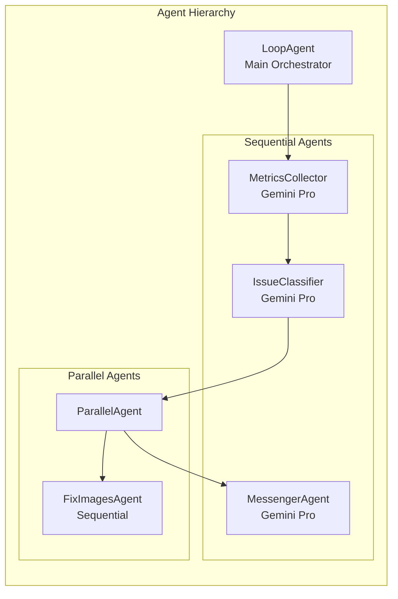

### 3. Database Components

#### Supabase PostgreSQL
- **Purpose**: Persistent storage for performance metrics and optimization history
- **Tables**:
  - `performance_metrics`
  - `optimization_history`
- **Features**: Row Level Security (RLS) enabled

#### JSON Log Files
- **Purpose**: Local file-based storage for immediate data access
- **Files**:
  - `performance_log.json` - Performance metrics log
  - Application logs in `/app/logs/`

### 4. External Integrations

#### Google PageSpeed Insights API
- **Purpose**: Web performance analysis and Core Web Vitals measurement
- **Rate Limiting**: 0.5 calls/second (2-second intervals)
- **Metrics Collected**: LCP, TBT, INP, Performance Score

#### Shopify Admin API
- **Purpose**: Theme modification and asset optimization
- **Safety Features**: Preview theme testing before live deployment
- **Operations**: CSS optimization, image compression, script optimization

#### Slack Integration
- **Purpose**: Real-time notifications and alerts
- **Notification Types**:
  - Performance SLA violations
  - Optimization completions
  - System errors and alerts

## Key Data Models

### Performance Metrics Model
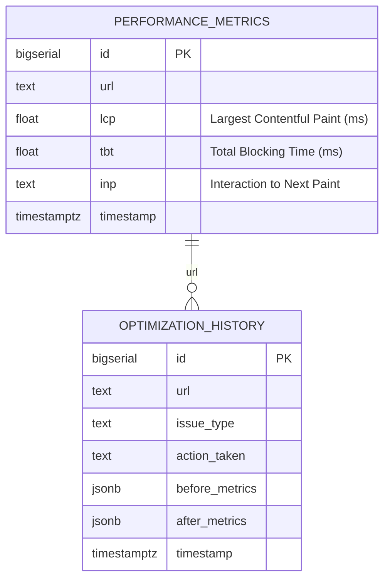

### Configuration Model
```typescript
interface PerformanceSLAs {
  LCP: number;        // 4000ms threshold
  TBT: number;        // 400ms threshold
  INP: string;        // 'GOOD' threshold
}

interface WatchlistConfig {
  urls: string[];     // Monitored URLs
  frequency: string;  // Check frequency
}

interface ThemeConfig {
  preview_theme_id: string;
  live_theme_id: string;
  shop_domain: string;
}
```

### API Response Models
```typescript
interface PerformanceAnalysisResult {
  status: 'completed' | 'error';
  url: string;
  performance_score: number;
  lcp: number;
  tbt: number;
  inp: string;
  issues_found: number;
  optimizations_applied: number;
  timestamp: string;
}

interface OptimizationResult {
  action: string;
  status: 'completed' | 'failed';
  shop_domain: string;
  safety_check: string;
}
```

## Core Workflows

### 1. Continuous Performance Monitoring Workflow
```mermaid
sequenceDiagram
    participant Timer as Scheduler
    participant Loop as Performance Loop
    participant PSI as PageSpeed API
    participant Classifier as Issue Classifier
    participant Optimizer as Theme Optimizer
    participant Slack as Slack Notifications
    participant DB as Database
    
    Timer->>Loop: Trigger (every 24h)
    
    loop For each monitored URL
        Loop->>PSI: Fetch performance data
        PSI-->>Loop: Performance metrics
        
        Loop->>Classifier: Classify issues
        Classifier-->>Loop: Prioritized issues
        
        Loop->>DB: Store metrics
        
        alt Critical/High Priority Issues Found
            Loop->>Optimizer: Apply optimizations
            Optimizer-->>Loop: Optimization results
            Loop->>Slack: Send notification
        end
    end
    
    Loop->>Slack: Send summary report
```

### 2. Manual Performance Analysis Workflow
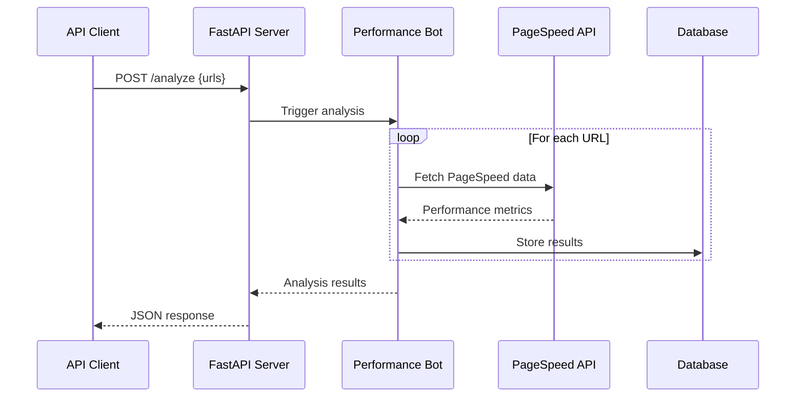

## Technology Stack

### Backend Technologies
| Component | Technology | Version | Purpose |
|-----------|------------|---------|---------|
| **API Framework** | FastAPI | ≥0.115.0 | REST API server |
| **ASGI Server** | Uvicorn | ≥0.34.0 | Production ASGI server |
| **AI Framework** | Google ADK | ≥1.3.0 | AI agent orchestration |
| **Agent Protocol** | MCP Agent | ≥0.1.3 | Model Context Protocol |
| **A2A Middleware** | A2A | ≥0.44 | Agent-to-Agent communication |
| **HTTP Client** | Requests | ≥2.32.0 | External API calls |
| **Async HTTP** | aiohttp | ≥3.12.0 | Async HTTP operations |
| **Environment** | python-dotenv | ≥1.1.0 | Configuration management |
| **Validation** | Pydantic | ≥2.11.0 | Data validation |

### Database Technologies
| Component | Technology | Purpose |
|-----------|------------|---------|
| **Primary Database** | Supabase (PostgreSQL) | Persistent data storage |
| **Local Storage** | JSON Files | Fast access logs |
| **Database Driver** | psycopg2-binary | PostgreSQL connectivity |

### Infrastructure Technologies
| Component | Technology | Version | Purpose |
|-----------|------------|---------|---------|
| **Containerization** | Docker | Latest | Application packaging |
| **Orchestration** | Docker Compose | Latest | Multi-container management |
| **Reverse Proxy** | Traefik | v3.0 | SSL termination, load balancing |
| **Process Management** | Supervisor | Latest | Service management |

### Monitoring Technologies
| Component | Technology | Purpose |
|-----------|------------|---------|
| **Metrics Collection** | Prometheus | Time-series metrics storage |
| **Visualization** | Grafana | Dashboards and alerting |
| **Log Aggregation** | Loki | Centralized log management |
| **Log Shipping** | Promtail | Log collection and forwarding |
| **Error Tracking** | Sentry SDK | Error monitoring and reporting |
| **APM** | Datadog | Application performance monitoring |

## External Integrations

### Google PageSpeed Insights API
**Configuration:**
- API Key: `PSI_KEY` environment variable
- Rate Limiting: 2-second intervals between requests
- Strategy: Mobile-first analysis
- Categories: Performance metrics only

### Shopify Admin API
**Configuration:**
- Shop Domain: `SHOP_DOMAIN` environment variable
- Access Token: `SHOP_TOKEN` environment variable
- Preview Theme: `PREVIEW_THEME_ID` for safe testing
- Live Theme: `THEME_ID_LIVE` for production deployment

### Slack Integration
**Configuration:**
- Webhook URL: `SLACK_BOT_TOKEN` environment variable
- Channel: Configurable via webhook settings
- Message Format: Structured JSON payloads

## Deployment Architecture

### Resource Allocation
| Service | CPU Limit | Memory Limit | CPU Reserve | Memory Reserve |
|---------|-----------|--------------|-------------|----------------|
| **SloeLux PerfBot** | 2.0 cores | 2GB | 0.5 cores | 512MB |
| **Prometheus** | 1.0 core | 1GB | 0.2 cores | 256MB |
| **Grafana** | 0.5 cores | 512MB | 0.1 cores | 128MB |
| **Loki** | 0.5 cores | 512MB | 0.1 cores | 128MB |
| **Traefik** | 0.5 cores | 256MB | 0.1 cores | 64MB |

## Monitoring & Observability

### Alert Configuration
| Alert Type | Threshold | Severity | Notification Channel |
|------------|-----------|----------|---------------------|
| **Performance Degradation** | Score < 70 | Critical | Slack + Email |
| **API Error Rate** | > 5% | High | Slack |
| **System Resource** | CPU > 80% | Medium | Slack |
| **Service Down** | Health check fail | Critical | Slack + Email |
| **SLA Violation** | LCP > 4s or TBT > 400ms | High | Slack + Email |

## Security Considerations

### Authentication & Authorization
- **A2A Middleware**: Agent-to-Agent authentication for internal communications
- **API Key Management**: Secure storage of external API credentials
- **Row Level Security**: Database-level access controls in Supabase
- **Environment Variables**: Sensitive configuration stored in `.env` files

### Network Security
- **SSL/TLS Termination**: Traefik handles HTTPS with Let's Encrypt certificates
- **Internal Network**: Docker network isolation for service communication
- **Port Exposure**: Minimal external port exposure (80, 443, monitoring ports)

### Data Protection
- **Credential Encryption**: API keys and tokens stored securely
- **Log Sanitization**: Sensitive data filtered from logs
- **Database Security**: PostgreSQL with RLS policies
- **Backup Strategy**: Automated database backups via Supabase

### Operational Security
- **Health Checks**: Continuous service monitoring
- **Resource Limits**: Container resource constraints prevent resource exhaustion
- **Error Handling**: Graceful error handling with proper logging
- **Rate Limiting**: API rate limiting to prevent abuse

---

*This architectural document provides a comprehensive overview of the SloeLux Performance Bot system. For implementation details, refer to the individual component documentation and source code.*

## Table of Contents
1. [High-Level Application Overview](#high-level-application-overview)
2. [System Architecture](#system-architecture)
3. [Main Components](#main-components)
4. [Key Data Models](#key-data-models)
5. [Core Workflows](#core-workflows)
6. [Technology Stack](#technology-stack)
7. [External Integrations](#external-integrations)
8. [Deployment Architecture](#deployment-architecture)
9. [Monitoring & Observability](#monitoring--observability)
10. [Security Considerations](#security-considerations)

## High-Level Application Overview

### Purpose
The SloeLux Performance Bot is an **automated web performance monitoring and optimization system** designed specifically for the SloeLux e-commerce website. The system continuously monitors website performance metrics, identifies optimization opportunities, and automatically applies fixes to improve user experience and Core Web Vitals scores.

### Key Objectives
- **Continuous Monitoring**: 24/7 performance tracking of critical pages
- **Automated Optimization**: AI-driven theme and asset optimization
- **SLA Compliance**: Ensure performance metrics meet defined thresholds
- **Proactive Alerting**: Real-time notifications for performance degradation
- **Safe Deployment**: Preview-first optimization with rollback capabilities

### Business Value
- Improved user experience through faster page loads
- Better SEO rankings via Core Web Vitals optimization
- Reduced manual intervention in performance management
- Data-driven insights for performance optimization decisions

## System Architecture


## Main Components

### 1. Frontend Components
**Web Dashboard** (Accessed via Grafana)
- **Purpose**: Real-time performance monitoring and alerting interface
- **Technology**: Grafana dashboards with custom panels
- **Features**:
  - Performance metrics visualization
  - Alert management
  - Historical trend analysis
  - System health monitoring

### 2. Backend Components

#### FastAPI Server (`fastapi_server.py`)
- **Purpose**: Primary REST API for external integrations
- **Port**: 8000
- **Key Endpoints**:
  - `GET /` - Health check
  - `POST /analyze` - Trigger performance analysis
  - `POST /optimize` - Apply theme optimizations
  - `GET /metrics` - Retrieve performance data
  - `GET /status` - Bot status information
  - `POST /webhook/deploy` - Deployment webhooks

#### MCP Server (`mcp_server.py`)
- **Purpose**: Model Context Protocol server for AI agent communication
- **Port**: 9000
- **Features**: Function registration and execution for AI agents

#### Performance Loop Agent (`perf_loop.py`)
- **Purpose**: Core monitoring engine with continuous execution loop
- **Execution Frequency**: Every 24 hours
- **Monitored URLs**:
  - `https://sloelux.com`
  - `https://sloelux.com/collections/all`
  - `https://sloelux.com/products/sample-product`

#### AI Agent System (`agents.py`)


### 3. Database Components

#### Supabase PostgreSQL
- **Purpose**: Persistent storage for performance metrics and optimization history
- **Tables**:
  - `performance_metrics`
  - `optimization_history`
- **Features**: Row Level Security (RLS) enabled

#### JSON Log Files
- **Purpose**: Local file-based storage for immediate data access
- **Files**:
  - `performance_log.json` - Performance metrics log
  - Application logs in `/app/logs/`

## Key Data Models

### Performance Metrics Model


### Configuration Model
```typescript
interface PerformanceSLAs {
  LCP: number;        // 4000ms threshold
  TBT: number;        // 400ms threshold
  INP: string;        // 'GOOD' threshold
}

interface WatchlistConfig {
  urls: string[];     // Monitored URLs
  frequency: string;  // Check frequency
}

interface ThemeConfig {
  preview_theme_id: string;
  live_theme_id: string;
  shop_domain: string;
}
```

### API Response Models
```typescript
interface PerformanceAnalysisResult {
  status: 'completed' | 'error';
  url: string;
  performance_score: number;
  lcp: number;
  tbt: number;
  inp: string;
  issues_found: number;
  optimizations_applied: number;
  timestamp: string;
}

interface OptimizationResult {
  action: string;
  status: 'completed' | 'failed';
  shop_domain: string;
  safety_check: string;
}
```

## Core Workflows

### 1. Continuous Performance Monitoring Workflow
```mermaid
sequenceDiagram
    participant Timer as Scheduler
    participant Loop as Performance Loop
    participant PSI as PageSpeed API
    participant Classifier as Issue Classifier
    participant Optimizer as Theme Optimizer
    participant Slack as Slack Notifications
    participant DB as Database
    
    Timer->>Loop: Trigger (every 24h)
    
    loop For each monitored URL
        Loop->>PSI: Fetch performance data
        PSI-->>Loop: Performance metrics
        
        Loop->>Classifier: Classify issues
        Classifier-->>Loop: Prioritized issues
        
        Loop->>DB: Store metrics
        
        alt Critical/High Priority Issues Found
            Loop->>Optimizer: Apply optimizations
            Optimizer-->>Loop: Optimization results
            Loop->>Slack: Send notification
        end
    end
    
    Loop->>Slack: Send summary report
```

### 2. Manual Performance Analysis Workflow


### 3. Theme Optimization Workflow
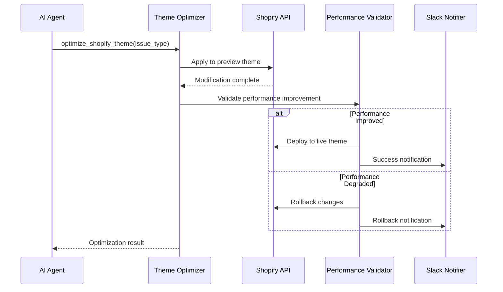

### 4. Alert and Notification Workflow
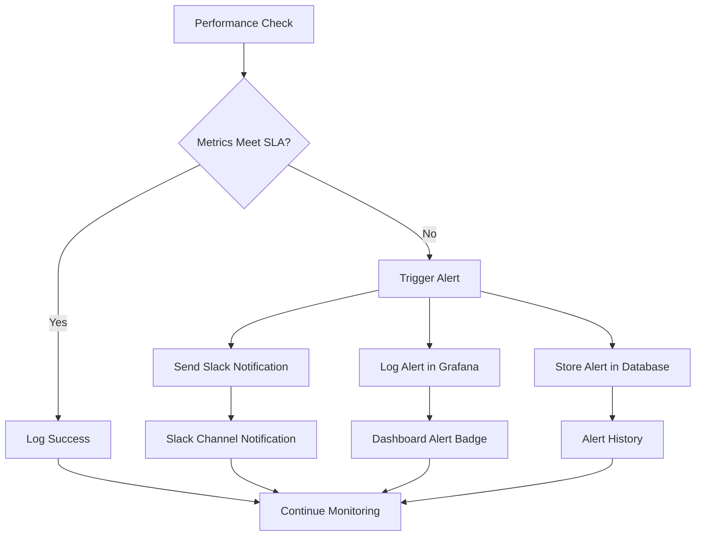

## Technology Stack

### Frontend Technologies
| Component | Technology | Version | Purpose |
|-----------|------------|---------|---------|
| **Dashboards** | Grafana | Latest | Performance visualization and alerting |
| **Monitoring UI** | Prometheus UI | Latest | Metrics query interface |
| **Proxy Dashboard** | Traefik Dashboard | v3.0 | Load balancer management |

### Backend Technologies
| Component | Technology | Version | Purpose |
|-----------|------------|---------|---------|
| **API Framework** | FastAPI | ≥0.115.0 | REST API server |
| **ASGI Server** | Uvicorn | ≥0.34.0 | Production ASGI server |
| **AI Framework** | Google ADK | ≥1.3.0 | AI agent orchestration |
| **Agent Protocol** | MCP Agent | ≥0.1.3 | Model Context Protocol |
| **A2A Middleware** | A2A | ≥0.44 | Agent-to-Agent communication |
| **HTTP Client** | Requests | ≥2.32.0 | External API calls |
| **Async HTTP** | aiohttp | ≥3.12.0 | Async HTTP operations |
| **Environment** | python-dotenv | ≥1.1.0 | Configuration management |
| **Validation** | Pydantic | ≥2.11.0 | Data validation |

### Database Technologies
| Component | Technology | Purpose |
|-----------|------------|---------|
| **Primary Database** | Supabase (PostgreSQL) | Persistent data storage |
| **Local Storage** | JSON Files | Fast access logs |
| **Database Driver** | psycopg2-binary | PostgreSQL connectivity |

### Infrastructure Technologies
| Component | Technology | Version | Purpose |
|-----------|------------|---------|---------|
| **Containerization** | Docker | Latest | Application packaging |
| **Orchestration** | Docker Compose | Latest | Multi-container management |
| **Reverse Proxy** | Traefik | v3.0 | SSL termination, load balancing |
| **Process Management** | Supervisor | Latest | Service management |

### Monitoring Technologies
| Component | Technology | Purpose |
|-----------|------------|---------|
| **Metrics Collection** | Prometheus | Time-series metrics storage |
| **Visualization** | Grafana | Dashboards and alerting |
| **Log Aggregation** | Loki | Centralized log management |
| **Log Shipping** | Promtail | Log collection and forwarding |
| **Error Tracking** | Sentry SDK | Error monitoring and reporting |
| **APM** | Datadog | Application performance monitoring |

## External Integrations

### Google PageSpeed Insights API
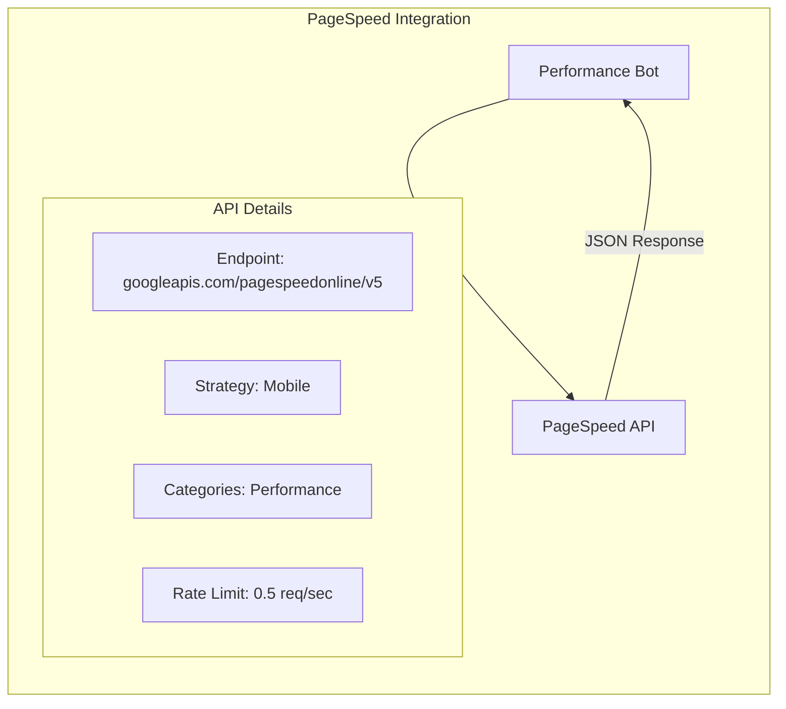

**Configuration:**
- API Key: `PSI_KEY` environment variable
- Rate Limiting: 2-second intervals between requests
- Strategy: Mobile-first analysis
- Categories: Performance metrics only

### Shopify Admin API
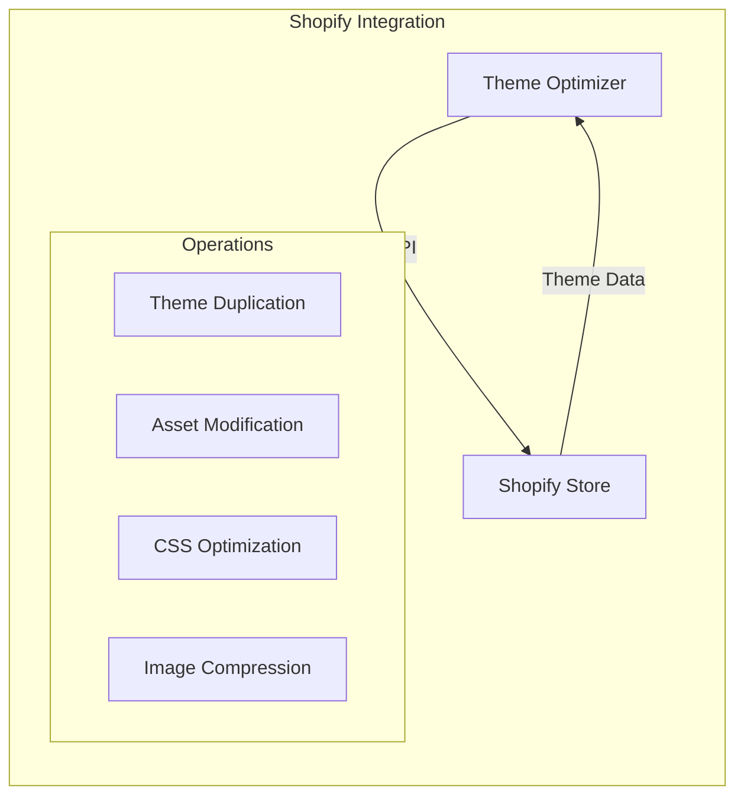

**Configuration:**
- Shop Domain: `SHOP_DOMAIN` environment variable
- Access Token: `SHOP_TOKEN` environment variable
- Preview Theme: `PREVIEW_THEME_ID` for safe testing
- Live Theme: `THEME_ID_LIVE` for production deployment

### Slack Integration
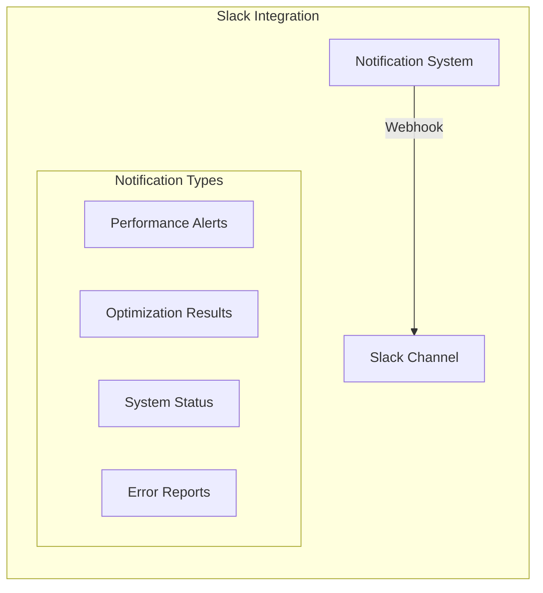

**Configuration:**
- Webhook URL: `SLACK_BOT_TOKEN` environment variable
- Channel: Configurable via webhook settings
- Message Format: Structured JSON payloads

## Deployment Architecture

### Production Environment
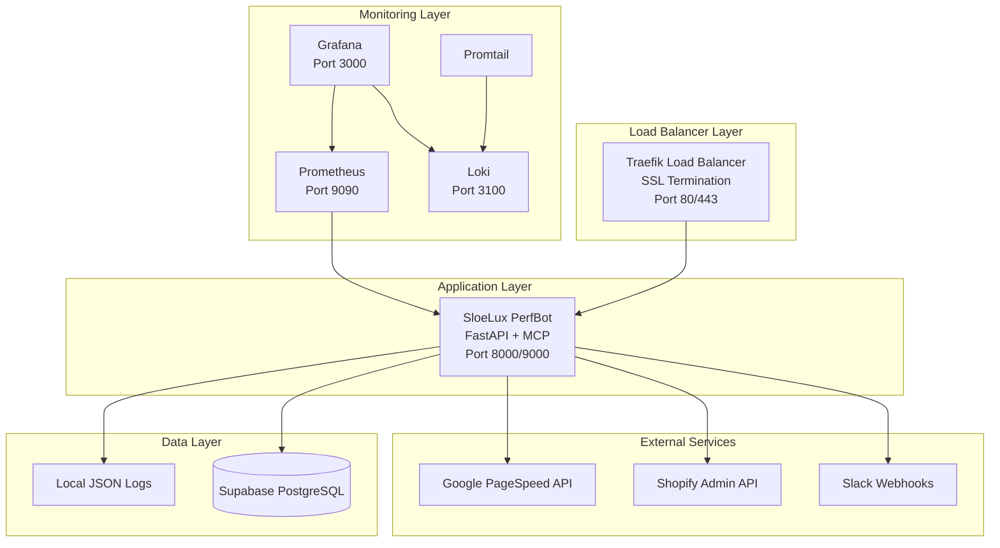

### Container Architecture
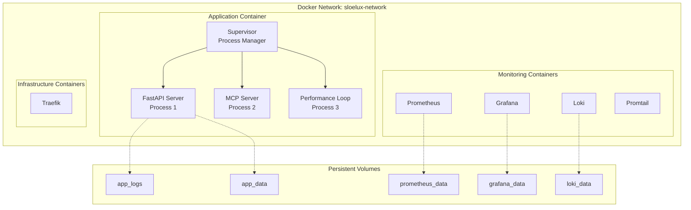

### Resource Allocation
| Service | CPU Limit | Memory Limit | CPU Reserve | Memory Reserve |
|---------|-----------|--------------|-------------|----------------|
| **SloeLux PerfBot** | 2.0 cores | 2GB | 0.5 cores | 512MB |
| **Prometheus** | 1.0 core | 1GB | 0.2 cores | 256MB |
| **Grafana** | 0.5 cores | 512MB | 0.1 cores | 128MB |
| **Loki** | 0.5 cores | 512MB | 0.1 cores | 128MB |
| **Traefik** | 0.5 cores | 256MB | 0.1 cores | 64MB |

## Monitoring & Observability

### Metrics Collection Strategy
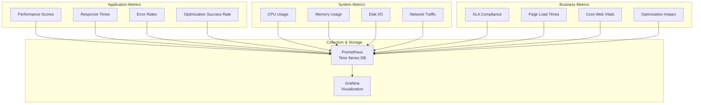

### Alert Configuration
| Alert Type | Threshold | Severity | Notification Channel |
|------------|-----------|----------|---------------------|
| **Performance Degradation** | Score < 70 | Critical | Slack + Email |
| **API Error Rate** | > 5% | High | Slack |
| **System Resource** | CPU > 80% | Medium | Slack |
| **Service Down** | Health check fail | Critical | Slack + Email |
| **SLA Violation** | LCP > 4s or TBT > 400ms | High | Slack + Email |

### Log Management
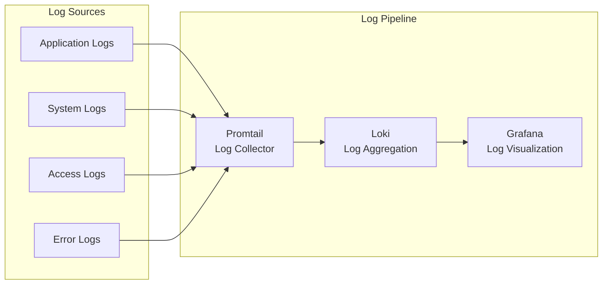

## Security Considerations

### Authentication & Authorization
- **A2A Middleware**: Agent-to-Agent authentication for internal communications
- **API Key Management**: Secure storage of external API credentials
- **Row Level Security**: Database-level access controls in Supabase
- **Environment Variables**: Sensitive configuration stored in `.env` files

### Network Security
- **SSL/TLS Termination**: Traefik handles HTTPS with Let's Encrypt certificates
- **Internal Network**: Docker network isolation for service communication
- **Port Exposure**: Minimal external port exposure (80, 443, monitoring ports)

### Data Protection
- **Credential Encryption**: API keys and tokens stored securely
- **Log Sanitization**: Sensitive data filtered from logs
- **Database Security**: PostgreSQL with RLS policies
- **Backup Strategy**: Automated database backups via Supabase

### Operational Security
- **Health Checks**: Continuous service monitoring
- **Resource Limits**: Container resource constraints prevent resource exhaustion
- **Error Handling**: Graceful error handling with proper logging
- **Rate Limiting**: API rate limiting to prevent abuse

---

*This architectural document provides a comprehensive overview of the SloeLux Performance Bot system. For implementation details, refer to the individual component documentation and source code.* 